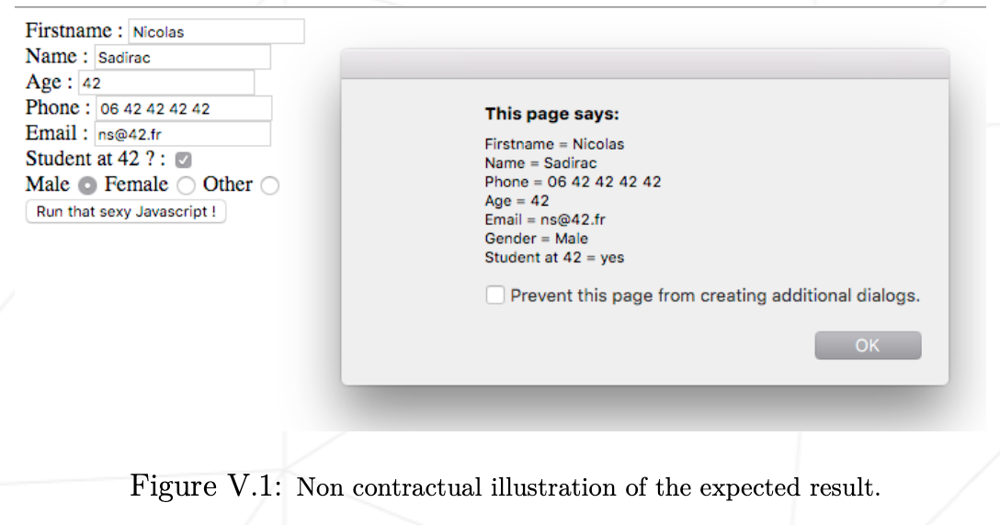
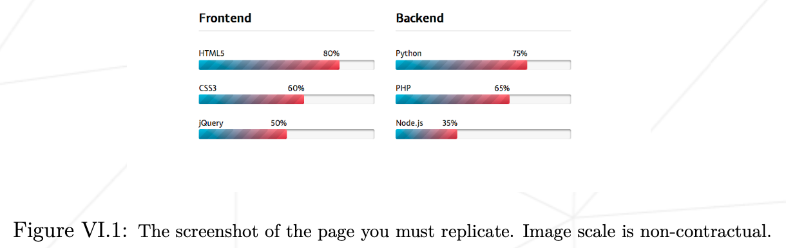

# Subject 번역

> 첫 날에는 웹 개발의 기본을 익힐 수 있습니다. HTTP, HTML, CSS, 페이지에 존재하는 JS 스크립트의 통합에 대해 알아봅시다.

## General rules

-   당신의 프로젝트는 반드시 VM위에서 구현해야 합니다.
-   당신의 VM은 프로젝트를 완료하기 위한 필요한 모든 소프트웨어가 설치되어 있고, 설정되어 있어야 합니다.
-   VM의 운영체제는 자유롭게 선택할 수 있습니다.
-   VM을 클러스터 컴퓨터에서 사용할 수 있어야 합니다.
-   VM과 호스트 머신 간 공유 폴더를 사용해야만 합니다.
-   평가 도중, 작업물을 옮기기 위해 이 공유 폴더를 사용할 것입니다.
-   당신의 함수들은 UB를 제외하고 예기치 못하게 종료되어선 안됩니다. (Seg fault, bus error, double free 등) 발생 시, 프로젝트가 정상 동작하지 않는 것으로 간주하고 0점을 받게 됩니다.
-   제출할 필요가 없고 채점되지 않더라도, 프로젝트에 대한 테스트 프로그램을 만드는 것이 좋습니다. 이렇게 하면 자신의 작업과 동료의 작업을 쉽게 테스트할 수 있습니다. 이러한 테스트는 디펜스 중에 특히 유용합니다. 실제로 디펜스 중에는 자신의 테스트 및/또는 평가하는 동료의 테스트를 자유롭게 사용할 수 있습니다.
-   할당된 git 저장소에 작업을 제출합니다. git 저장소에 있는 작업만 채점됩니다. 작업 채점을 위해 Deepthought이 배정된 경우, 동료 평가가 끝난 후에 채점이 이루어집니다. Deepthought이 채점하는 동안 작업의 어느 부분에서든 오류가 발생하면 평가가 중지됩니다.

## Ex 00

> 예제 0: 첫번째 쉘 스크립트
>
> `ex00/myawesomescript.sh`로 제출.
>
> `curl`, `grep`, `cut` 허용

-   트위터에 특별한 비밀이 없다면 매우 유용한 URL 단축 서비스인 `bit.ly`를 알고 계실 것입니다.
-   이 예제에서는 유효한 것으로 추정되는 bit.ly 주소의 실제 주소, 즉 'bit.ly 링크가 연결되는 주소'를 표시하는 쉘 스크립트를 작성하여 제출하는 것을 목표로 합니다.
-   이 예제 초입에 써있듯, 허용되는 쉘 명령어만 사용 가능합니다. : `curl`, `grep`, `cut`
-   가장 좋은 시작은 `man curl` 일 것 입니다.
-   당신의 쉘 스크립트가 어떻게 동작해야 하는지에 대한 예제입니다.

```bash
$> ./myawesomescript.sh bit.ly/1072s3U
http://42.fr/
$>
```

-   위의 예시는 스크립트가 실행 파일이어야 함을 분명히 보여줍니다. 인터프리터로 /bin/sh를 사용해야 합니다.
-   당신의 스크립트를 레포의 루트 밑 `ex00` 폴더에 넣어 제출하세요.

## Ex 01

> 예제 1: HTML로 쓴 당신의 레쥬메
>
> `ex01/cv.html`로 제출.
>
> 요구사항 참조

이력서를 HTML/css로 작성할 때는 다음 제약 조건을 준수해야 합니다:

-   HTML 태그의 의미와 스타일과 콘텐츠의 분리를 준수해야 합니다.
-   이름, 성별, 기술 및 경력 경로 등 최소한의 필수 콘텐츠가 포함된 일관된 HTML 파일을 작성해야 합니다.
-   제목 태그가 있는 제목과 `h1` 태그가 있는 제목을 하나 이상 표시해야 합니다.
-   `table`, `th`, `tr` 및 `td` 태그가 포함된 표를 하나 이상 사용해야 합니다.
-   `ul` 태그가 있는 목록과 `ol` 태그가 있는 목록을 하나 이상 사용해야 합니다. 요소는 `li` 태그를 사용해야 합니다.
-   표 테두리가 표시되어야 합니다(실선). 표 테두리가 병합되어야 합니다(접힘).
-   표의 가장 아래쪽 오른쪽 셀의 테두리 색상은 `#424242` 여야 합니다.
-   앞의 각 지침에 대해 서로 다른 구문 솔루션을 사용해야 합니다. 첫 번째 지침의 경우 페이지 헤드에 있는 스타일 태그를 사용합니다. 두 번째는 태그의 스타일 속성을 적절하게 사용합니다.

> 정보의 진실성에 대한 특별한 지침은 없습니다. 위의 지침을 따르기만 하면 원하는 대로 멋진 이력서를 만들 수 있습니다.

## Ex 02

> 예제 2: 이메일 전송 폼
>
> `ex02/form.html`로 제출.
>
> 요구사항 참조

연락처의 일반적인 정보를 나타내는 HTML 양식을 만듭니다. 이 양식에는 다음과 같은 필드가 표시됩니다:

-   이름: 텍스트 필드입니다.
-   이름: 역시 텍스트 필드입니다.
-   나이: HTML5 전용의 특정 숫자 필드를 사용해야 합니다.
-   전화: HTML5 전용 전화 필드를 사용해야 합니다.
-   이메일: HTML5 전용 이메일 필드를 사용해야 합니다.
-   42 학생?: 체크박스 필드를 사용해야 합니다.
-   성별: 남성, 여성 및 기타 값이 있는 라디오 버튼을 사용해야 합니다.
-   양식 제출 버튼. 버튼의 `onclick` 속성은 반드시 `displayFormContent` 여야 합니다.

이 주제 인트라 첨부파일의 `d00.tar.gz`에는 회사에서 인턴으로 일하는 상사의 아들이 작성한 Javascript 팝업이 포함된 `ex02/` 하위 폴더가 있습니다. 상사의 아들이 프로그래밍에 관한 한 무능한 얼간이처럼 느껴지게 하고 싶지 않다면 아들의 파일을 수정할 수 없으므로 그대로 사용해야 합니다.

> 제공된 코드를 꼼꼼히 읽고 피상적으로 이해해야 합니다.
> 자바스크립트 코드를 철저히 읽고 피상적으로 이해해야 이 연습을 완료할 수 있습니다.

이 자바스크립트 파일을 HTML 페이지에 올바르게 통합해야 합니다. HTML 코드가 올바르면 양식 버튼을 누르면 최신 팝업이 나타납니다. 여기에는 양식의 필드와 값이 포함됩니다. 그렇지 않다면 HTML 코드에 결함이 있는 것입니다.



## Ex 03

> 예제 3: 웹 페이지 복제
>
> `ex03/copy.html`로 제출.
>
> 요구사항 참조

경쟁 업체가 회사보다 더 멋진 웹사이트를 업로드했습니다. 산업 스파이라는 심각한 임무 덕분에 상사는 페이지의 스크린샷과 해당 CSS 파일을 얻게 됩니다. 이 주제의 부록에 있는 `d00.tar.gz` 아카이브와 `ex03/` 하위 폴더에 있는 두 파일에 모두 액세스할 수 있습니다.

이 페이지를 최대한 충실하게 복제해야 합니다!



다시 한 번 스타일과 콘텐츠를 분리하고, 사용할 태그의 의미를 존중하며, 문서의 구조를 논리적으로 유지해야 합니다.

제공된 CSS 파일을 수정하지 않고 그대로 사용해야 합니다. 이 지침을 준수했는지 확인하기 위해 평가 시 "새로운" 버전의 CSS가 사용됩니다.

## Ex 04

> 예제 4: 스니펫 JS 통합
>
> `ex04/snippets.html`로 제출.
>
> 요구사항 참조

이 주제 부록의 `d00.tar.gz`는 `ex04/` 하위 폴더가 있으며, 이 폴더에는 동일한 4개의 파일(`file1.js`, `file2.js`, `file3.js` 및 `file4.js`)이 포함되어 있습니다.

팝업이 올바르게 표시되도록(즉, 이상한 문자가 표시되지 않도록) 4개의 스크립트를 가져와야 하는 `snippets.html` 파일을 생성하여 제출해야 합니다.

> 특정 스크립트를 import 할 수 없습니다. 변형할 수도 없습니다. HTML 코드에 인라인 JS를 사용할 수 없습니다.

## Ex 05

> 예제 5: W3C 검증
>
> `ex05/index.html`로 제출.
>
> 요구사항 참조

코드는 멋집니다. 좋은 코드가 더 좋습니다. 그리고 좋은 코드를 작성하려면 좋은 규범을 따라야 합니다.

W3C 규범은 필수이며, HTML을 작성하거나 생성할 때 그 형식을 존중해야 합니다.

이 서브젝트 부록에 있는 `d00.tar.gz` 에는 `ex05/` 하위 폴더가 있습니다. 여기에는 전체 웹 페이지의 소스가 들어 있습니다. 안타깝게도 이 소스는 여러분보다 숙련도가 훨씬 낮은 개발자가 작성했습니다!

[W3C 유효성 검사](https://validator.w3.org/)를 통과할 수 있도록 html 색인 파일의 HTML 코드를 편집하세요! 이것은 오류나 경고를 의미하지 않습니다.

파일을 잘라내지 말고 편집해야 합니다. 즉, 편집할 파일의 콘텐츠가 리포지토리에 있는 파일 전체에 포함되어야 합니다.
