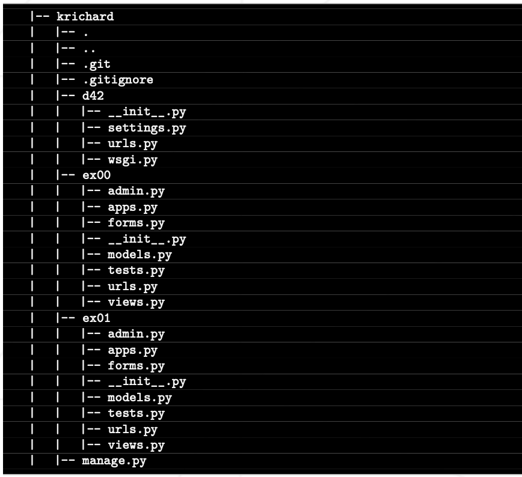

# Subject 번역

> 오늘은 장고의 ORM에 태클을 걸 것 입니다.

## General rules

-   당신의 프로젝트는 반드시 VM위에서 구현해야 합니다.
-   당신의 VM은 프로젝트를 완료하기 위한 필요한 모든 소프트웨어가 설치되어 있고, 설정되어 있어야 합니다.
-   VM의 운영체제는 자유롭게 선택할 수 있습니다.
-   VM을 클러스터 컴퓨터에서 사용할 수 있어야 합니다.
-   VM과 호스트 머신 간 공유 폴더를 사용해야만 합니다.
-   평가 도중, 작업물을 옮기기 위해 이 공유 폴더를 사용할 것입니다.
-   당신의 함수들은 UB를 제외하고 예기치 못하게 종료되어선 안됩니다. (Seg fault, bus error, double free 등) 발생 시, 프로젝트가 정상 동작하지 않는 것으로 간주하고 0점을 받게 됩니다.
-   제출할 필요가 없고 채점되지 않더라도, 프로젝트에 대한 테스트 프로그램을 만드는 것이 좋습니다. 이렇게 하면 자신의 작업과 동료의 작업을 쉽게 테스트할 수 있습니다. 이러한 테스트는 디펜스 중에 특히 유용합니다. 실제로 디펜스 중에는 자신의 테스트 및/또는 평가하는 동료의 테스트를 자유롭게 사용할 수 있습니다.
-   할당된 git 저장소에 작업을 제출합니다. git 저장소에 있는 작업만 채점됩니다. 작업 채점을 위해 Deepthought이 배정된 경우, 동료 평가가 끝난 후에 채점이 이루어집니다. Deepthought이 채점하는 동안 작업의 어느 부분에서든 오류가 발생하면 평가가 중지됩니다.

## 추가되는 규칙

-   반드시 `python3` 인터프리터를 사용합니다.
-   각 예제는 독립적입니다. 필요한 기능 중 일부가 이전 예제에서 이미 다루어졌다면 현재 예제에서 해당 기능을 복제합니다.
-   `postgresql` 을 사용해야 합니다. 이름은 `djangotraining`을 사용하고, `djangouser`라는 이름의 유저를 생성합니다. 비밀번호는 `secret`이며, 모든 권한을 갖게 됩니다.
-   리포지토리 폴더는 반드시 장고 프로젝트여야 합니다. 프로젝트 이름은 현재 날짜의 이름을 따서 지어야 합니다.
-   장고의 애플리케이션 개념을 사용하여 예제를 분리하겠습니다:
    오늘의 예제는 일치하는 예제의 이름을 딴 특정 장고 애플리케이션에 있어야 하며 리포지토리의 루트에 위치해야 합니다.
-   예제의 요구 사항을 충족하려면 장고 프로젝트가 올바르게 구성되어 있어야 합니다. 평가 중에는 구성을 변경할 수 없습니다.
-   마이그레이션을 작업물과 함께 제출할 수 없습니다.
-   ORM이 언급된 각 예제에서는 반드시 장고의 ORM을 사용해야 합니다. SQL을 한 줄도 작성해서는 안 됩니다.
-   SQL이 언급된 각 예제에서는 반드시 `psycopg2` 라이브러리를 사용하여 모든 요청을 `SQL`로 실행해야 합니다.

다음은 두 개의 연습 문제를 포함한 d42일에 대한 krichard라는 학생의 리포지토리에 대한 일반적인 구조 예제입니다:



> 스마트하게 코드를 구성하고 사용하기 쉽게 만드세요. 시간을 아낄 수 있습니다.

## Ex 00

> 예제 0: SQL - 테이블 만들기

`ex00` 라는 이름의 장고 애플리케이션을 만듭니다. `127.0.0.1:8000/ex00/init` URL에서 내부 뷰에 접근 가능해야 합니다.

이 뷰는 `psycopg2` 라이브러리를 사용하여 `Postgresql`에서 SQL 테이블을 생성하고 성공하면 "OK"가 포함된 페이지를 반환해야 합니다. 그렇지 않으면 문제를 설명하는 오류 메시지를 반환해야 합니다.

SQL 테이블은 다음 설명을 만족합니다:

-   이름이 `ex00_movies`
-   존재하지 않을 경우에만 새로 생성
-   다음 필드들을 가짐
    -   `title`: 유니크, 가변 문자열, 64바이트, non null.
    -   `episode_nb`: full, PRIMARY KEY.
    -   `opening_crawl`: text, nullable, 크기 제한 없음
    -   `director`: 가변 문자열, non null, 32바이트
    -   `producer`: 가변 문자열, non null, 128바이트
    -   `release_date`: 날짜 (시간 제외), non null

## Ex 01

> 예제 1: ORM - 테이블 만들기

`ex01` 애플리케이션을 만드세요. 그 안에 이 필드가 정확히 포함된 Movies라는 이름의 장고 모델을 만듭니다:

-   `title`: 유니크, 가변 문자열, 64바이트, non null.
-   `episode_nb`: full, PRIMARY KEY.
-   `opening_crawl`: text, nullable, 크기 제한 없음
-   `director`: 가변 문자열, non null, 32바이트
-   `producer`: 가변 문자열, non null, 128바이트
-   `release_date`: 날짜 (시간 제외), non null

이 모델은 `__str__()` 메서드가 반드시 재정의되어야 하며, `title` 속성을 반환해야 합니다.

## Ex 02

> 예제 2: SQL - 데이터 삽입

`ex02` 애플리케이션 을 생성하세요. 이 애플리케이션에는 다음 URL을 통해 접근 가능한 뷰가 있습니다.

-   `127.0.0.1:8000/ex02/init`
    -   `ex00`와 동일한 사양의 테이블을 만들어야 하며, 이름은 `ex02_movies`로 지정해야 합니다.
    -   성공했다면 "OK" 가 표시된 페이지를 반환하고, 그렇지 않다면 발생한 문제를 설명하는 메시지를 표시합니다.
-   `127.0.0.1:8000/ex02/populate`
    -   이전 뷰로 생성된 테이블에 다음 데이터를 삽입합니다.
    -   episode_nb: 1 - title: The Phantom Menace - director: George Lucas - pro- ducer: Rick McCallum - release_date: 1999-05-19
    -   episode_nb: 2 - title: Attack of the Clones - director: George Lucas - producer: Rick McCallum - release_date: 2002-05-16
    -   episode_nb: 3 - title: Revenge of the Sith - director: George Lucas - producer: Rick McCallum - release_date: 2005-05-19
    -   episode_nb: 4 - title: A New Hope - director: George Lucas - producer: Gary Kurtz, Rick McCallum - release_date: 1977-05-25
    -   episode_nb: 5 - title: The Empire Strikes Back - director: Irvin Kershner - producer: Gary Kurtz, Rick McCallum - release_date: 1980-05-17
    -   episode_nb: 6 - title: Return of the Jedi - director: Richard Marquand - producer: Howard G. Kazanjian, George Lucas, Rick McCallum - release_date: 1983-05-25
    -   episode_nb: 7 - title: The Force Awakens - director: J. J. Abrams - producer: Kathleen Kennedy, J. J. Abrams, Bryan Burk - release_date: 2015-12-11
    -   삽입에 성공할 때마다 "OK"를 표시하는 페이지를 반환해야 합니다. 그렇지 않으면 문제를 설명하는 오류 메시지가 표시되어야 합니다.
-   `127.0.0.1:8000/ex02/display`
    -   `ex02_movies`에 포함된 모든 데이터를 최종적으로 무효인 필드를 포함하여 HTML 테이블로 표시합니다.
    -   데이터가 없거나 에러가 발생하면, "No data available" 을 표시합니다.

## Ex 03

> 예제 3: ORM - 데이터 삽입

`ex03`이라는 이름의 새 장고 애플리케이션을 만듭니다. 그 안에 `ex01`에서 만든 것과 동일한 장고 모델을 만듭니다.
이 애플리케이션에는 다음 URL을 통해 접근할 수 있는 뷰가 포함되어야 합니다:

-   `127.0.0.1:8000/ex03/populate`
    -   이 애플리케이션의 모델인 다음 데이터를 삽입해야 합니다.
    -   episode_nb: 1 - title: The Phantom Menace - director: George Lucas - pro- ducer: Rick McCallum - release_date: 1999-05-19
    -   episode_nb: 2 - title: Attack of the Clones - director: George Lucas - producer: Rick McCallum - release_date: 2002-05-16
    -   episode_nb: 3 - title: Revenge of the Sith - director: George Lucas - producer: Rick McCallum - release_date: 2005-05-19
    -   episode_nb: 4 - title: A New Hope - director: George Lucas - producer: Gary Kurtz, Rick McCallum - release_date: 1977-05-25
    -   episode_nb: 5 - title: The Empire Strikes Back - director: Irvin Kershner - producer: Gary Kurtz, Rick McCallum - release_date: 1980-05-17
    -   episode_nb: 6 - title: Return of the Jedi - director: Richard Marquand - producer: Howard G. Kazanjian, George Lucas, Rick McCallum - release_date: 1983-05-25
    -   episode_nb: 7 - title: The Force Awakens - director: J. J. Abrams - producer: Kathleen Kennedy, J. J. Abrams, Bryan Burk - release_date: 2015-12-11
    -   삽입에 성공할 때마다 "OK"를 표시하는 페이지를 반환해야 합니다. 그렇지 않으면 문제를 설명하는 오류 메시지가 표시되어야 합니다.
-   `127.0.0.1:8000/ex03/display`
    -   `Movies`에 포함된 모든 데이터를 최종적으로 무효인 필드를 포함하여 HTML 테이블로 표시합니다.
    -   데이터가 없거나 에러가 발생하면, "No data available" 을 표시합니다.

> 평가 중에는 테스트 전에 마이그레이션이 수행됩니다.

## Ex 04

> 예제 4: SQL - 데이터 삭제

`ex04` 라는 이름의 애플리케이션을 만드세요. 다음 URL을 통해 접근 가능한 뷰를 포함해야 합니다.

-   `127.0.0.1:8000/ex04/init`
    -   `ex00`와 동일한 사양의 테이블을 만들어야 하며, 이름은 `ex04_movies`로 지정해야 합니다.
    -   성공했다면 "OK" 가 표시된 페이지를 반환하고, 그렇지 않다면 발생한 문제를 설명하는 메시지를 표시합니다.
-   `127.0.0.1:8000/ex04/populate`
    -   이전 뷰에서 만든 테이블에 예제 `ex02`에 설명된 데이터를 삽입해야 합니다.
    -   이 뷰는 어떠한 삭제된 데이터라도 재삽입해야 합니다.
    -   삽입에 성공했다면 "OK"가 표시된 페이지를 반환하고, 그렇지 않다면 발생한 문제를 설명하는 메시지를 표시합니다.
-   `127.0.0.1:8000/ex04/display`
    -   `ex04_movies`에 포함된 모든 데이터를 최종적으로 무효인 필드를 포함하여 HTML 테이블로 표시합니다.
    -   데이터가 없거나 에러가 발생하면, "No data available" 을 표시합니다.
-   `127.0.0.1:8000/ex04/remove`
    -   영화 타이틀의 드롭다운 리스트를 포함하는 HTML 폼을 표시해야 합니다.
    -   `remove`라는 이름의 `submit` 버튼이 있어야 합니다.
    -   영화 타이틀은 `ex04_movies` 테이블에서 가져옵니다.
    -   폼의 유효성이 검사되면 선택한 영화가 데이터베이스에서 삭제되고 나머지 영화가 포함된 업데이트된 목록이 폼에 다시 표시됩니다.
    -   데이터가 없거나 에러가 발생하면, "No data available" 을 표시합니다.

## Ex 05

> 예제 5: ORM - 데이터 삭제

`ex05`이라는 이름의 새 장고 애플리케이션을 만듭니다. 그 안에 `ex01`에서 만든 것과 동일한 장고 모델을 만듭니다.
이 애플리케이션에는 다음 URL을 통해 접근할 수 있는 뷰가 포함되어야 합니다:

-   `127.0.0.1:8000/ex05/populate`
    -   이전 뷰에서 만든 테이블에 예제 `ex02`에 설명된 데이터를 삽입해야 합니다.
    -   이 뷰는 어떠한 삭제된 데이터라도 재삽입해야 합니다.
    -   삽입에 성공했다면 "OK"가 표시된 페이지를 반환하고, 그렇지 않다면 발생한 문제를 설명하는 메시지를 표시합니다.
-   `127.0.0.1:8000/ex05/display`
    -   `ex04_movies`에 포함된 모든 데이터를 최종적으로 무효인 필드를 포함하여 HTML 테이블로 표시합니다.
    -   데이터가 없거나 에러가 발생하면, "No data available" 을 표시합니다.
-   `127.0.0.1:8000/ex05/remove`
    -   영화 타이틀의 드롭다운 리스트를 포함하는 HTML 폼을 표시해야 합니다.
    -   `remove`라는 이름의 `submit` 버튼이 있어야 합니다.
    -   영화 타이틀은 `Movies` 모델에서 가져옵니다.
    -   폼의 유효성이 검사되면 선택한 영화가 데이터베이스에서 삭제되고 나머지 영화가 포함된 업데이트된 목록이 폼에 다시 표시됩니다.
    -   데이터가 없거나 에러가 발생하면, "No data available" 을 표시합니다.

> 평가 중에는 테스트 전에 마이그레이션이 수행됩니다.

## Ex 06

> 예제 6: SQL - 데이터 갱신

`ex06`이라는 이름의 새 장고 애플리케이션을 만듭니다. 이 애플리케이션에는 다음 URL을 통해 접근할 수 있는 뷰가 포함되어야 합니다:

-   `127.0.0.1:8000/ex06/init`

    -   `ex00`와 동일한 사양의 테이블을 만들어야 하며, 이름은 `ex06_movies`로 지정해야 합니다. 아래의 추가 필드를 포함합니다.
        -   `created`: _datetime_ 타입으로, 언제 생성되었는지 자동으로 설정되어야 합니다.
        -   `updated`: _datetime_ 타입으로, 언제 생성되었는지 자동으로 설정되어야 하며, 다음의 트리거를 통해 자동으로 업데이트되어야 합니다.

    ```sql
    CREATE OR REPLACE FUNCTION update_changetimestamp_column()
    RETURNS TRIGGER AS $$
    BEGIN
    NEW.updated = now();
    NEW.created = OLD.created;
    RETURN NEW;
    END;
    $$ language 'plpgsql';
    CREATE TRIGGER update_films_changetimestamp BEFORE UPDATE
    ex06_movies FOR EACH ROW EXECUTE PROCEDURE
    update_changetimestamp_column();
    ```

-   `127.0.0.1:8000/ex06/populate`
    -   이전 뷰에서 만든 테이블에 예제 `ex02`에 설명된 데이터를 삽입해야 합니다.
    -   이 뷰는 어떠한 삭제된 데이터라도 재삽입해야 합니다.
    -   삽입에 성공했다면 "OK"가 표시된 페이지를 반환하고, 그렇지 않다면 발생한 문제를 설명하는 메시지를 표시합니다.
-   `127.0.0.1:8000/ex06/display`
    -   `ex06_movies`에 포함된 모든 데이터를 최종적으로 무효인 필드를 포함하여 HTML 테이블로 표시합니다.
    -   데이터가 없거나 에러가 발생하면, "No data available" 을 표시합니다.
-   `127.0.0.1:8000/ex06/update`
    -   폼의 전송과 수신을 관리해야 합니다.
    -   후자는 `ex06_movies` 테이블에 포함된 영화가 포함된 드롭다운 메뉴에서 영화를 선택하고 두 번째 필드에 텍스트를 작성할 수 있어야 합니다.
    -   양식의 유효성을 검사할 때, 뷰는 선택한 영화의 `ex06_movies` 테이블의 `opening_crawl` 필드를 폼에 입력된 텍스트로 대체해야 합니다.
    -   데이터가 없거나 에러가 발생하면, "No data available" 을 표시합니다.

## Ex 07

> 예제 7: ORM - 데이터 갱신

`ex07`이라는 이름의 새 장고 애플리케이션을 만듭니다. 그 안에 `ex01`에서 만든 것과 동일한 장고 모델을 만듭니다. 아래의 추가 필드를 포함합니다.

-   `created`: _datetime_ 타입으로, 언제 생성되었는지 자동으로 설정되어야 합니다.
-   `updated`: _datetime_ 타입으로, 언제 생성되었는지 자동으로 설정되어야 하며, 업데이트 마다 자동으로 갱신됩니다.

이 애플리케이션에는 다음 URL을 통해 접근할 수 있는 뷰가 포함되어야 합니다:

-   `127.0.0.1:8000/ex07/populate`
    -   이전 뷰에서 만든 테이블에 예제 `ex02`에 설명된 데이터를 삽입해야 합니다.
    -   삽입에 성공했다면 "OK"가 표시된 페이지를 반환하고, 그렇지 않다면 발생한 문제를 설명하는 메시지를 표시합니다.
-   `127.0.0.1:8000/ex07/display`
    -   `ex04_movies`에 포함된 모든 데이터를 최종적으로 무효인 필드를 포함하여 HTML 테이블로 표시합니다.
    -   데이터가 없거나 에러가 발생하면, "No data available" 을 표시합니다.
-   `127.0.0.1:8000/ex07/update`
    -   폼의 전송과 수신을 관리해야 합니다.
    -   후자는 `Movies` 모델에 포함된 영화가 포함된 드롭다운 메뉴에서 영화를 선택하고 두 번째 필드에 텍스트를 작성할 수 있어야 합니다.
    -   -   양식의 유효성을 검사할 때, 뷰는 선택한 영화의 `Movies` 모델의 `opening_crawl` 필드를 폼에 입력된 텍스트로 대체해야 합니다.
    -   데이터가 없거나 에러가 발생하면, "No data available" 을 표시합니다.

> 평가 중에는 테스트 전에 마이그레이션이 수행됩니다.

## Ex 08

> 예제 8: SQL - 외래 키

`ex08`이라는 이름의 새 장고 애플리케이션을 만듭니다. 이 애플리케이션에는 다음 URL을 통해 접근할 수 있는 뷰가 포함되어야 합니다:

-   `127.0.0.1:8000/ex08/init`
    -   두 개의 테이블을 만듭니다. 첫 테이블의 이름은 `ex08_planets`이며, 다음 필드를 포함합니다:
        -   `id`: _serial_, PRIMARY KEY
        -   `name`: 유니크, 가변 문자열, 64 바이트, non null
        -   `climate`: 가변 문자열
        -   `diameter`: whole (역: 모든 숫자형을 담을 수 있는 타입인 것 같음. 아마도...?)
        -   `orbital_period`: whole
        -   `population`: large whole
        -   `rotation_period`: whole
        -   `surface_water`: real (역: 실수??)
        -   `terrain`: 가변 문자열, 128 바이트
    -   두 번째 테이블 이름은 `ex08_people`이며, 다음 필드를 포함합니다:
        -   `id`: _serial_, PRIMARY KEY
        -   `name`: 유니크, 가변 문자열, 64 바이트, non null
        -   `birth_year`: 가변 문자열, 32 바이트
        -   `gender`: 가변 문자열, 32 바이트
        -   `eye_color`: 가변 문자열, 32 바이트
        -   `hair_color`: 가변 문자열, 32 바이트
        -   `height`: whole
        -   `mass`: real
        -   `homeworld`: 가변 문자열, 64 바이트, 외래 키, `08_planets` 테이블의 `name` 칼럼을 참조
-   `127.0.0.1:8000/ex08/populate`
    -   일치하는 테이블에 각각 `people.csv` 및 `planets.csv` 파일의 내용을 복사한 두 테이블, 즉 ex08_people 및 ex08_planets을 채워야 합니다.
    -   삽입에 성공했다면 "OK"가 표시된 페이지를 반환하고, 그렇지 않다면 발생한 문제를 설명하는 메시지를 표시합니다.
-   `127.0.0.1:8000/ex08/display`
    -   모든 캐릭터의 이름과 고향, 바람이 많이 불거나 적당히 부는 기후를 캐릭터의 이름 알파벳 순서로 정렬하여 표시합니다.
    -   데이터가 없거나 에러가 발생하면, "No data available" 을 표시합니다.

> `psycopg2copy_from` 메서드에 대해 알아보세요.

## Ex 09

> 예제 9: ORM - 외래 키

`ex09`이라는 이름의 새 장고 애플리케이션을 만듭니다. 두 개의 모델을 만듭니다. 첫 번째 모델의 이름은 `Planets` 이며, 다음 필드를 포함합니다:

-   `name`: 유니크, 가변 문자열, 64 바이트, non null
-   `climate`: 가변 문자열
-   `diameter`: whole
-   `orbital_period`: whole
-   `population`: large whole
-   `rotation_period`: whole
-   `surface_water`: real (역: 실수??)
-   `terrain`: 문자열
-   `created`: _datetime_ 타입으로, 언제 생성되었는지 자동으로 설정되어야 합니다.\
-   `updated`: _datetime_ 타입으로, 언제 생성되었는지 자동으로 설정되어야 하며, 업데이트 마다 자동으로 갱신됩니다.
    이 모델은 반드시 `__str__()` 메서드를 재정의 해야 하며, `name` 속성을 반환합니다.

두 번째 모델의 이름은 `People` 이며, 다음 필드를 포함합니다:

-   `name`: 문자열, 64 바이트, non null
-   `birth_year`: 문자열, 32 바이트
-   `gender`: 문자열, 32 바이트
-   `eye_color`: 문자열, 32 바이트
-   `hair_color`: 문자열, 32 바이트
-   `height`: whole
-   `mass`: real
-   `homeworld`: 가변 문자열, 64 바이트, 외래 키, `Planets` 의 `name` 칼럼을 참조
-   `created`: _datetime_ 타입으로, 언제 생성되었는지 자동으로 설정되어야 합니다.\
-   `updated`: _datetime_ 타입으로, 언제 생성되었는지 자동으로 설정되어야 하며, 업데이트 마다 자동으로 갱신됩니다.
    이 모델은 반드시 `__str__()` 메서드를 재정의 해야 하며, `name` 속성을 반환합니다.

`127.0.0.1:8000/ex09/display` 로 접근 가능한 뷰를 생성합니다.
이 뷰는 모든 캐릭터의 이름과 고향, 바람이 많이 불거나 적당히 부는 기후를 캐릭터의 이름 알파벳 순서로 정렬하여 HTML 테이블로 표시합니다.

사용 가능한 데이터가 없는 경우, 뷰에 다음 텍스트가 표시되어야 합니다: "No data available, please use the following command line before use:" (사용 가능한 데이터가 없습니다. 사용하기 전에 다음 커맨드라인을 사용하세요.)라는 텍스트와 명령줄이 이어집니다.

이 커맨드라인은 반드시 이전에 생성한 모델에 `ex09_initial_data.json` 파일(서브젝트와 함께 제공됨)에 포함된 모든 데이터를 삽입하기 위해 리포지토리의 루트에서 실행할 컴내드 라인이어야 합니다.

이 파일을 리포지토리에 제공해야 합니다.

> 평가 중에는 테스트 전에 마이그레이션이 수행됩니다.

## Ex 10

> 예제 10: ORM - 다 대 다 (Many to Many)

`ex10` 이라는 이름의 장고 애플리케이션을 만들고, 3개의 모델을 만듭니다.

-   `Planets`, `People` : `ex09`와 같습니다.
-   `Movies`: `ex01`과 동일한 사양에 `characters` 필드를 추가합니다. 이것은 `People` 모델과 **"many to many"** 관계입니다. `People`테이블에 포함된 영화 속 모든 캐릭터를 나열할 수 있습니다.

서브젝트와 함께 제공된 `ex10_initial_data.json` 파일에, 모델을 채우는데 필요한 수정 사항이 있습니다.

`127.0.0.1:8000/ex10` 로 접근 가능한 뷰를 생성합니다. 다음 필수적인 필드들을 포함하는 폼을 표시합니다:

-   `Movies minimum release date` : date
-   `Movies maximum release date` : date
-   `Planet diameter greater than` : number
-   `Character gender` : `People` 모델의 `gender` 필드에 존재하는 값들을 드롭다운 리스트로 보여줍니다. 같은 값이 두 번 표기되어서는 안됩니다.

유효성 검사가 완료되면 뷰는 결과를 검색, 반환 및 표시해야 합니다.

결과는 `Character gender` 필드와 성별이 일치하는 캐릭터, 출연 중인 영화, 영화가`Movies minimum release date` 와 `Movies maximum release date` 사이에 개봉한 경우 해당 영화, 행성의 지름이 `Planet diameter greater than` 와 같거나 더 큰 행성입니다.

검색 결과가 없다면, "Nothing corresponding to your research" 메시지가 보여야 합니다. 각 결과는 한 줄에 다음 요소들을 전부 표시해야 합니다. (순서는 고려하지 않습니다.)

-   캐릭터의 이름
-   캐릭터의 성별
-   영화 제목(타이틀)
-   고향(homeworld) 이름
-   고향(homeworld) 지름

예를 들어, `여성`, `1900-01-01` ~ `2000-01-01`, 지름 `11000` 이상으로 필터를 걸어 검색한 결과는 다음과 같습니다.

-   A New Hope - Leia Organa - female - Alderaan - 12500
-   The Phantom Menace - Padmé Amidala - female - Naboo - 12120
-   Return of the Jedi - Leia Organa - female - Alderaan - 12500
-   Return of the Jedi - Mon Mothma - female - Chandrila - 13500
-   The Empire Strikes Back -Leia Organa - female - Alderaan - 12500

> 여러 캐릭터가 같은 영화에 등장할 수도 있고 한 캐릭터가 여러 영화에 등장할 수도 있습니다. 이를 다대다 관계라고 합니다. 이 경우 이러한 테이블 사이에 중간 테이블을 만들어야 합니다. 이 중간 테이블의 각 행은 (고유한) 상호 참조입니다. 첫 번째 행은 영화 테이블의 행을 참조합니다. 두 번째 행은 캐릭터 테이블의 행을 참조합니다(또는 그 반대). 모델이 빌드되고 마이그레이션이 완료되면 포스트그레 콘솔을 통해 이 테이블을 볼 수 있습니다.
